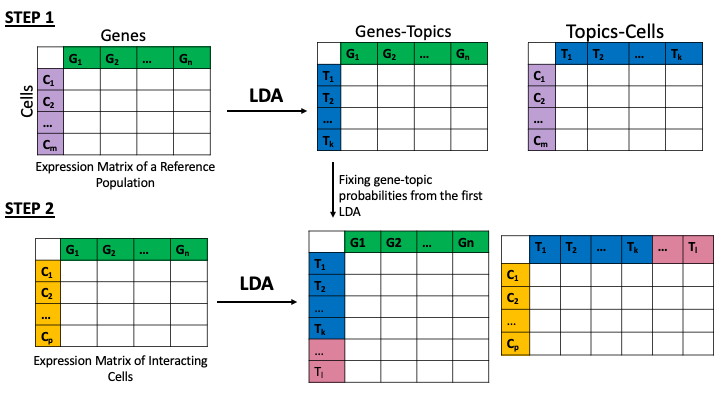

### LDA for detecting genes that change as a result of interaction

This repository contains: 
* LDA code
* Notebooks: synthetic doublets, PIC-seq, BM cells
* R scripts used for the pre-processing of the COVID data

#### Approach Overview

Firstly, we fit LDA on a reference population. Depending on the setting, the reference population could be sorted cells (Boisset's experiment) or co-cultures of the cell types involved in the interaction (PIC-seq experiment). Using the topic-gene probability vectors from the first LDA, we wit another LDA on the interacting population with some topic-gene probabilities fixed. 

#### Some analysis tips

1. Choosing number of topics for the 1st LDA. We have shown that underspecifying the number of topics, especially in the first LDA, is problematic and as such we recommend the following: 
    *  Consider the complexity of the dataset: How many cell types are there? Are there multiple timepoints?
    *  Perform perplexity analysis
    *  Explore results with different number of topics

2. Application to datasets designed to capture interaction. For such datasets the following analysis procedure can be followed: 
    * Fit LDA on the reference. Advice on choosing number of topics above. 
    * Fit 2nd LDA with some topic-gene probabilities fixed on the interacting population

3. Application to 10x and other technologies not designed to capture interaction. While caution should be taken when interpreting the results, some suggestions can be found below: 
    * Identify the reference population: in our COVID-19 example those were cells presumed to be singlets. 
    * Identify potentially interacting cells: We defined potentially interacting cells as the doublets in the data. To label doublets and singlets in the data we used DoubletFinder. 
    * Perform analysis on one sample at the time if patient samples. 
   
   

